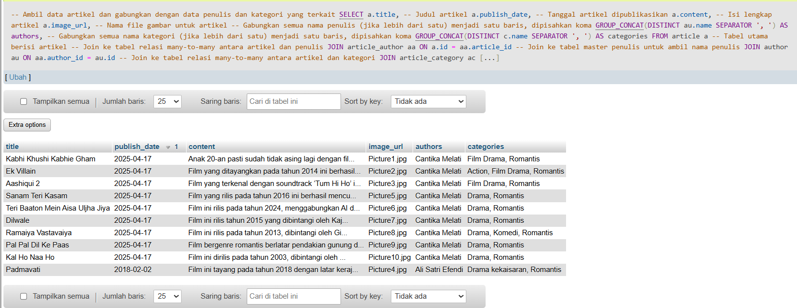
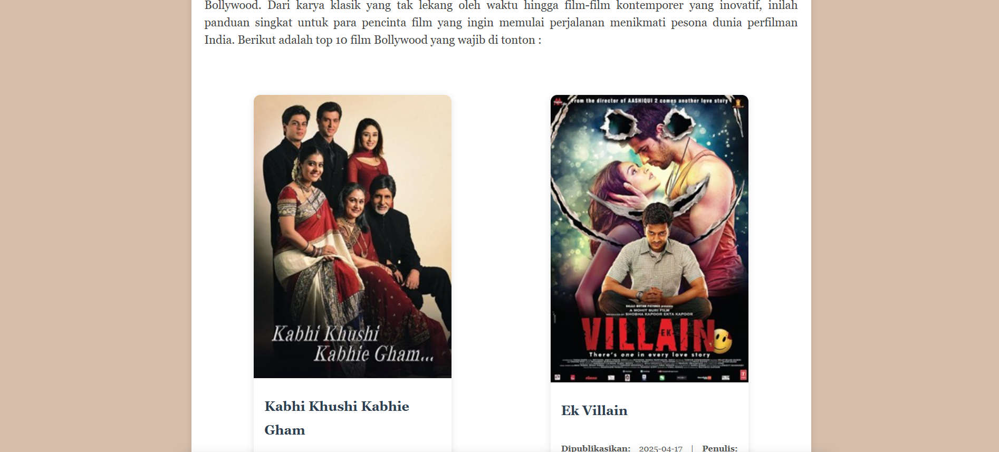
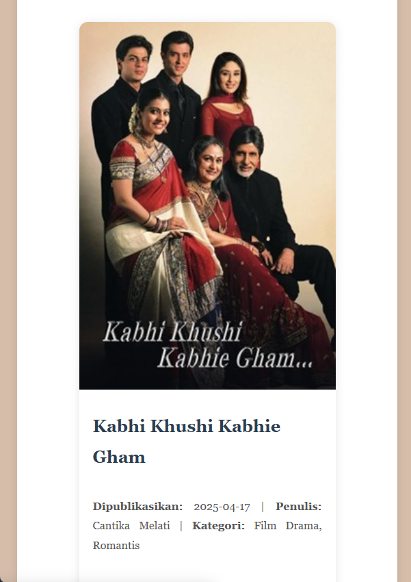

# Tugas Pemrograman Web
## Topik: Perancangan dan Implementasi Blog Dinamis Berbasis Database

### 📌 Latar Belakang
Blog dinamis merupakan salah satu contoh aplikasi web yang umum digunakan. Dalam tugas ini, Anda diminta untuk merancang dan mengimplementasikan sebuah blog yang menampilkan artikel dari basis data secara terstruktur. Implementasi mencakup penggunaan relasi antar data (artikel, penulis, kategori), serta antarmuka yang estetis menggunakan HTML dan CSS.

### 📁 Struktur Database
Database terdiri dari 5 tabel relasional: 
- **Tabel master:**
  - `article`: Menyimpan data artikel seperti judul, isi, tanggal, dan gambar.
  - `author`: Menyimpan data penulis.
  - `category`: Menyimpan data kategori artikel.
- **Tabel relasi many-to-many:**
  - `article_author`: Relasi antara artikel dan penulis.
  - `article_category`: Relasi antara artikel dan kategori.

Setiap tabel telah dilengkapi dengan primary key, foreign key, dan tipe data yang sesuai.

### 🎨 Desain Template Web
- Desain menggunakan HTML dan CSS eksternal (`style.css`)
- Artikel ditampilkan dalam layout berbentuk kartu (card)
- Setiap artikel memuat: judul, tanggal, penulis, kategori, gambar, dan isi artikel
- Tampilan responsif dan modern

### 🚀 Cara Menjalankan
1. Jalankan XAMPP atau server lokal dan aktifkan MySQL
2. Import file `blog_bollywood2.sql` ke phpMyAdmin
3. Simpan seluruh file ke dalam folder `htdocs/blog-bollywood2/`:
   ```
   /blog-bollywood2/
   ├── index.php
   ├── koneksi.php
   ├── style.css
   ├── images/ (berisi Picture1.jpg - Picture12.jpg)
   └── databases/blog_bollywood.sql
   └── documents/ (berisi gambar dokumentasi README.md)
   └── icon/ (berisi assets svg icon)
   └── README.md
   ```
4. Akses via browser: `http://localhost/blog-bollywood2/index.php`

### 🛠️ Fitur Unggulan
- Konten artikel ditarik langsung dari database
- Dukungan multiple penulis dan kategori per artikel
- Template bersih dan terstruktur menggunakan card
- Gambar artikel otomatis tampil dari folder `images/`

### 🧠 Query SQL
Project ini menggunakan query SQL kompleks dengan `JOIN` untuk menampilkan informasi lengkap artikel berupa:
- Judul artikel
- Tanggal publikasi
- Nama penulis (bisa lebih dari satu)
- Nama kategori (bisa lebih dari satu)
- Isi artikel

Hasil query ditampilkan dalam bentuk yang terstruktur dan rapi menggunakan `GROUP_CONCAT` dan `ORDER BY`. Berikut adalah Query harus mengambil data dari beberapa tabel sekaligus dengan menggunakan JOIN, dan hasilnya ditampilkan dalam bentuk tabel terstruktur :

```sql
-- Ambil data artikel dan gabungkan dengan data penulis dan kategori yang terkait
SELECT 
    a.title,                  -- Judul artikel
    a.publish_date,          -- Tanggal artikel dipublikasikan
    a.content,               -- Isi lengkap artikel
    a.image_url,             -- Nama file gambar untuk artikel

    -- Gabungkan semua nama penulis (jika lebih dari satu) menjadi satu baris, dipisahkan koma
    GROUP_CONCAT(DISTINCT au.name SEPARATOR ', ') AS authors,

    -- Gabungkan semua nama kategori (jika lebih dari satu) menjadi satu baris, dipisahkan koma
    GROUP_CONCAT(DISTINCT c.name SEPARATOR ', ') AS categories

FROM article a  -- Tabel utama berisi artikel

-- Join ke tabel relasi many-to-many antara artikel dan penulis
JOIN article_author aa ON a.id = aa.article_id
-- Join ke tabel master penulis untuk ambil nama penulis
JOIN author au ON aa.author_id = au.id

-- Join ke tabel relasi many-to-many antara artikel dan kategori
JOIN article_category ac ON a.id = ac.article_id
-- Join ke tabel master kategori untuk ambil nama kategori
JOIN category c ON ac.category_id = c.id

-- Kelompokkan hasil per artikel (karena kita pakai GROUP_CONCAT)
GROUP BY a.id

-- Urutkan hasil berdasarkan tanggal publish (terbaru di atas)
ORDER BY a.publish_date DESC;
```
### OUTPUT : 


---

### 🛠️ Preview Tampilan Website Mode Desktop dan Mobile 






UIN Malang
### 🛠️ Note
File utama yang digunakan untuk menampilkan halaman blog ini adalah `index.php`, bukan `index.html`. Hal ini dikarenakan konten blog ditampilkan secara dinamis dari database menggunakan PHP dan query SQL. Dengan menggunakan `index.php`, sistem dapat mengambil dan menampilkan data artikel secara otomatis melalui script PHP, yang tidak bisa dilakukan oleh file HTML statis.

### 🛠️ Kesimpulan
Proyek blog ini dibuat untuk menampilkan artikel rekomendasi film Bollywood secara dinamis dari database. Prosesnya melibatkan perancangan struktur tabel yang saling terhubung, penulisan query SQL yang menggabungkan data dari beberapa tabel, serta penyusunan tampilan web yang rapi dan menarik. Setiap artikel bisa memiliki banyak penulis dan kategori, dan semuanya ditampilkan dalam bentuk card yang berisi judul, isi, gambar, dan informasi lainnya. Proyek ini menjadi latihan yang baik untuk memahami cara kerja aplikasi web dinamis, dari backend sampai frontend.

---
📝 Disusun oleh: **Cantika Melati Nugraini** - 230605110039 - Teknik Informatika UIN Malang
